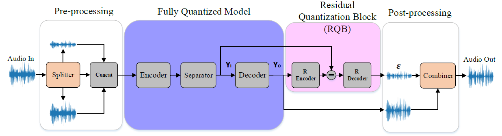
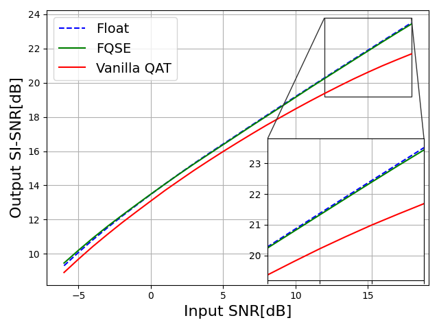

# Fully Quantized Speech Enhancement (FQSE)

## Abstract
Deep learning models have shown state-of-the-art results in speech enhancement. However, deploying such models on an eight-bit integer-only device is challenging. In this work, we analyze the gaps in deploying a vanilla quantization-aware training method for speech enhancement, revealing two significant observations. First, quantization mainly affects signals with a high input Signal-to-Noise Ratio (SNR). Second, quantizing the model's input and output shows major performance degradation. Based on our analysis, we propose Fully Quantized Speech Enhancement (FQSE), a new quantization-aware training method that closes these gaps and enables eight-bit integer-only quantization. FQSE introduces data augmentation to mitigate the quantization effect on high SNR. Additionally, we add an input splitter and a residual quantization block to the model to overcome the error of the input-output quantization. We show that FQSE closes the performance gaps induced by eight-bit quantization.





## Librimix Dataset

LibriMix is an open source dataset for source separation in noisy environments. It is derived from LibriSpeech signals (clean subset) and WHAM noise. It offers a free alternative to the WHAM dataset and complements it.
It will also enable cross-dataset experiments. Please refer to [Librimix](https://github.com/JorisCos/LibriMix) for more information.

## Installation
 ```shell script
 pip install requirements.txt
 ```

## Quantization Aware Training (QAT)

1. Generate Librimix dataset according to [Librimix](https://github.com/JorisCos/LibriMix). Please use Libri2Mix 16kHz and 'min' version of the dataset.

2. Download the pre-trained model:
   https://huggingface.co/JorisCos/ConvTasNet_Libri1Mix_enhsingle_16k/blob/main/pytorch_model.bin

3. Edit the configuration file (YML) `configs/convtasnet_16k_fqse.yml`.
   - Set work_dir: `/home/user-name`
   - Set dataset csv folders generated by step 1 as follows:
     - dataset->train_dir: `/your-librimix-path/data/wav16k/min/train-360`
     - dataset->valid_dir: `/your-librimix-path/data/wav16k/min/dev`
   - Set pre-trained model path in training->pretrained: `pytorch_model.bin`
   
   Note: The `convtasnet_16k_fqse.yml` configuration is our QAT 8bit (FQSE) as in the paper. 
   
5. Run `train.py`:
    ```shell script
    python train.py -y configs/convtasnet_16k_fqse.yml
    ```
   
## Validation
1. Edit the configuration file (YML) configs/convtasnet_16k.yml:
   - Set dataset csv folder generated by step 1 as follows:
     - dataset->test_dir: `/your-librimix-path/data/wav16k/min/test`
   - Set the model path in model->model_path: `trained_model.pth`
2. Run `val.py`:
    ```shell script
    python val.py -y configs/convtasnet_16k.yml
    ```

### SI-SNR benchmark on Librimix
| Network            | Float | Vanilla QAT 8bit | FQSE 8bit |
|--------------------|------:|-----------------:|----------:|
| ConvTasNet [1]     | 14.74 |            14.42 |     14.77 |


## Inference
Run `infer.py` on noisy speech:
 ```shell script
 python infer.py -y configs/convtasnet_16k_fqse.yml -a samples/speech/test_1spk_noisy_1.wav
 ```
   
## Export
Run `export.py`:
 ```shell script
 python export.py -y configs/convtasnet_16k_fqse.yml --torchscript --onnx
 ```

****

## Citation

If you find this project useful in your research, please consider cite:

```BibTeX

```
****

## Thanks

https://github.com/asteroid-team/asteroid

## References

[1] https://arxiv.org/pdf/1809.07454.pdf


